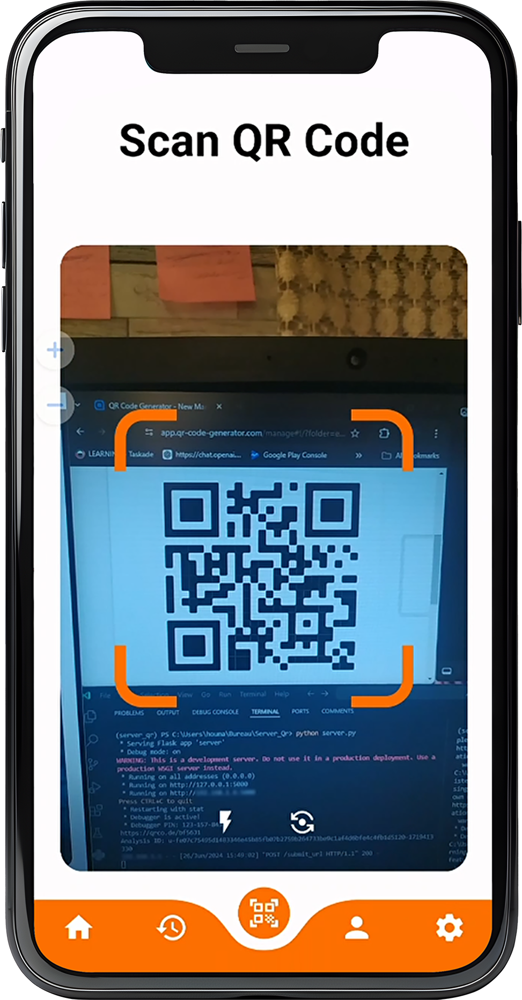
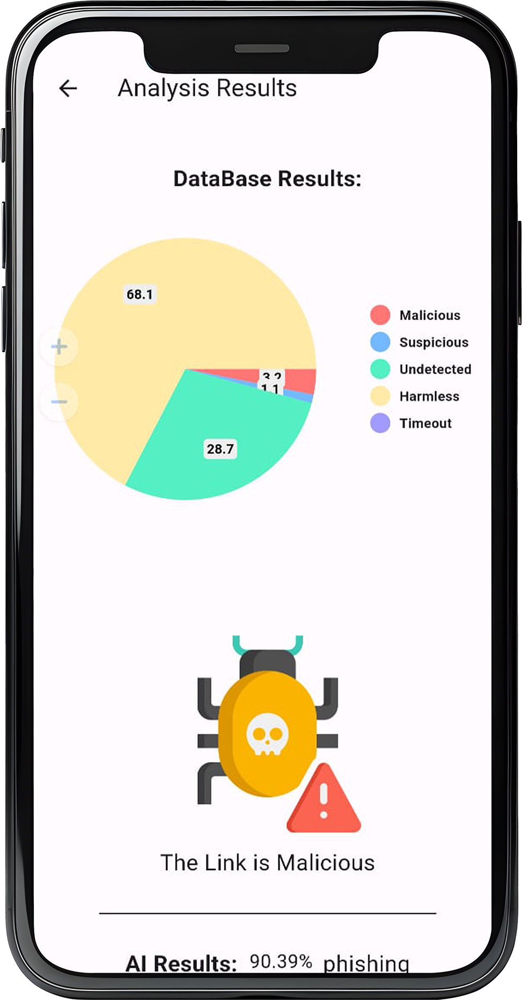
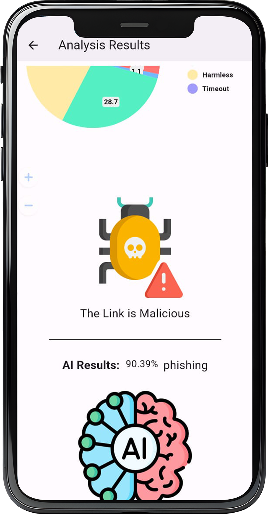

# QR Malware Detection

This project aims to detect malware embedded within QR codes, assisting law enforcement in scanning public QR codes, such as those found in subways and other public areas. It enhances public safety by identifying potentially malicious QR codes before they can cause harm.

## 📊 How It Works
1. **Initial Detection**: Utilizes the TotalVirus API for the first layer of detection.
2. **AI Model**: Employs an AI model for a second layer of detection, providing robust security.

## ✨ Features
- **Pre-trained Models**: Access and deploy pre-trained models quickly.

- **📱 Cross-Platform Application**: A Flutter-based application (`QR Malware Detection`) for seamless interaction with the model.
- **🌐 Server Backend**: A Flask server (`server_Qr/server.py` and `server_Qr/test.py`) that handles the malware detection process.

## ⚙️ Installation
To set up the project, follow these steps:

1. **Clone the Repository**:

2. **Create a Virtual Environment**:
   ```bash
   # Create a new conda environment with Python 3.12.3
   conda create --name myenv python=3.12.3

   # Activate the conda environment
   conda activate myenv
   ```

3. **Install Python Dependencies**:
   ```bash
   pip install -r requirements.txt
   ```

4. **Download the Model**:
   Download the [model](https://drive.google.com/drive/folders/1gHM5D3v-KAq6gsY1QvuuuQlNrHAviHQJ?usp=sharing) and add it to the `Server_Qr` folder.

5. **Install Flutter Dependencies**:
   Navigate to the `qr_code_malw` directory and run:
   ```bash
   flutter pub get
   ```

## 🚀 Usage

### 📱 Mobile Application

1. **Start the Server**:
   Navigate to the `Server_Qr` directory and run:
   ```bash
   python server.py
   ```

   Open another terminal and run:
   ```bash
   python test.py
   ```

2. **Run the Flutter Application**:
   Navigate to the `qr_code_malw` directory and execute:
   ```bash
   flutter run
   ```

## 📷 Screenshots

### Mobile Application





## 📜 License

This project is licensed under the MIT License - see the `LICENSE` file for details.

## 💘 Acknowledgements

- Thanks to the Flutter and PyTorch communities for their invaluable resources.